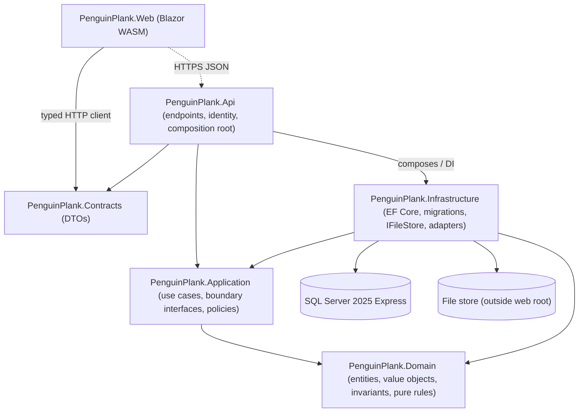
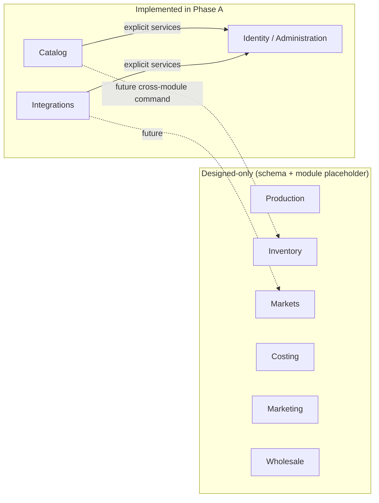
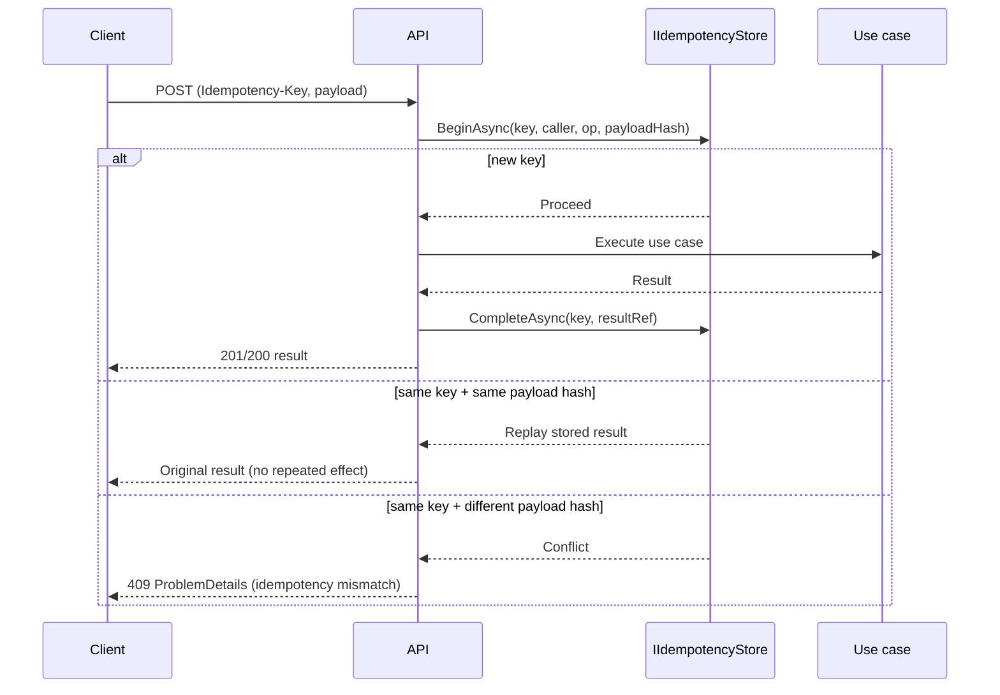
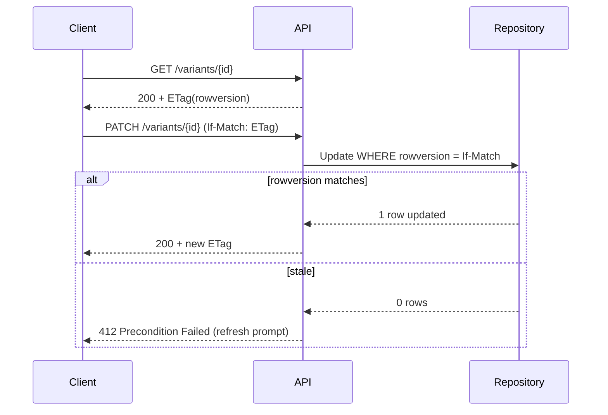
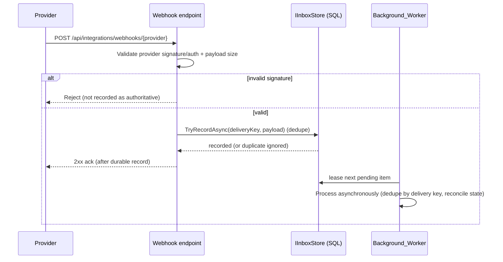

# Design Document

## Overview

This document is the Phase A design for the Penguin Plank private business application: the **foundation and shared catalog** release. It realizes the approved Phase A requirements (`requirements.md`) and conforms to the authoritative business specification (`Steering/Penguin-Plank-Kiro-Spec.md`) and the project coding standards (`.kiro/steering/coding-standards.md`).

Phase A has two distinct design responsibilities that must not be conflated:

1. **Design the complete business domain data model now.** Every entity in Section 6 of the specification is modeled here so that later phases (R02–R09 operational/costing/marketing/wholesale/dashboard and R12–R15 integrations) extend the schema rather than replace it. This prevents a disruptive schema migration later.
2. **Implement only Phase A deliverables.** Components, services, endpoints, and UI are built only for the Phase A scope. Entities belonging to later phases are *designed-only*: their tables and relationships are established (or planned as additive migrations) but no use cases, endpoints, or UI exercise them yet.

### Phase A objectives (R01, R10, R11, A1–A9)

- **A1** — Solution structure, module boundaries, build/CI, configuration, and error conventions.
- **A2** — EF Core schema and migrations for SQL Server 2025 Express, ASP.NET Core Identity, one-time Owner bootstrap, and enforced Owner/Staff role policies.
- **A3** — Catalog: Products, ProductVariants, ProductPieces, wood composition, CareProfile versioning, publication fields (**R01**, **R10**).
- **A4** — Audit records, ETag/optimistic concurrency, idempotency foundation, `IFileStore` storage adapter, authorized media access.
- **A4a** — Integration foundation (**R11**): connection records, EntityMapping, ExternalOrder/Reservation, credential references, durable inbox/outbox, SyncCheckpoint, exception queue, Background_Worker — with all concrete connectors **disabled**.
- **A5** — Blazor WebAssembly browser shell, login, catalog editing, typed API client.
- **A6** — Deployment, backup/restore baseline, SQL constraint verification.
- **A7/A8/A9** — Provider webhook endpoints and credential protection; time/localization/browser support; Phase A performance and capacity verification.

### What is implemented vs. designed-only

| Area | Phase A status |
|---|---|
| Catalog (Product, Variant, Piece, Wood, Care, Media metadata, ChannelListing, ExternalReference) | **Implemented** |
| Audit, Idempotency, ETag concurrency, IFileStore media | **Implemented** |
| Identity/Administration (staff identity, roles, Owner bootstrap, BusinessSettings, audit, settings/users endpoints) | **Implemented** |
| Integration foundation (connections, mappings, inbox/outbox, checkpoints, sync runs/exceptions, webhook surface, worker) | **Implemented, connectors disabled** |
| Production, Inventory, Markets, Costing, Marketing, Wholesale, Sales, Publishing, external orders | **Designed-only** (schema modeled; no services/endpoints/UI) |
| Concrete Shopify/Square/Faire/Etsy/Meta adapters | **Not implemented** (Phases E–G) |

### Non-goals (Phase A)

- Customer UI, customer authentication, public QR pages, shopping, reservations, custom orders, care reminders.
- Payment processing, card storage, checkout, accounting ledger, payroll, tax filing.
- Offline write queue or synchronization engine.
- Concrete platform connectors, outgoing inventory publishing, social publishing.
- Native mobile client.
- AI-generated descriptions or image editing.

---

## Architecture

The system is a **modular monolith**: a single API process and one relational database with explicit module boundaries. The browser never touches the database; all business data operations flow through the API, so a future mobile client can reuse the same application and domain services.

```
Browser (Blazor WASM)  ──HTTPS/JSON──►  ASP.NET Core API  ──►  Application use cases
                                                              ──►  Domain (pure rules)
                                                              ──►  Infrastructure (EF Core, IFileStore, adapters)
                                                              ──►  SQL Server 2025 Express
```

### Layered dependency diagram



**Dependency rule (enforced by project references and analyzers):**

- **Domain** depends on nothing external — no EF Core, ASP.NET Core, HTTP, UI, or file I/O (R01-driven invariants live here; see coding-standards §3).
- **Application** depends on Domain and on **narrow boundary interfaces** it defines (e.g. `ICatalogWriter`, `IFileStore`, `IInboxStore`). It references no concrete storage or UI.
- **Infrastructure** implements Application contracts using EF Core and adapters; business decisions stay in Domain/Application.
- **Api** is the composition root: HTTP mapping, authentication, request validation, response/error mapping, and DI registration. Thin endpoints, no duplicated business logic.
- **Contracts** holds versioned request/response DTOs only — no persistence entities, no server implementation dependency.
- **Web** consumes the API exclusively through a typed client aligned with Contracts. No database driver, connection string, EF context, or SQL.

### Module boundary diagram



Modules share a database but communicate across boundaries only through explicit application services — never shared mutable state, service locators, or ambient context (coding-standards §2). Only **Catalog**, **Integrations**, and **Identity/Administration** have implemented use cases in Phase A; the rest exist as namespace/folder placeholders plus their designed-only schema.

---

## Technology Stack

| Concern | Choice | Notes |
|---|---|---|
| Runtime | .NET 10 LTS (latest servicing patch) | ASP.NET Core 10, EF Core 10 |
| API | ASP.NET Core 10 Minimal APIs or controllers | OpenAPI, ProblemDetails |
| ORM | EF Core 10 | Migrations applied as a deployment step |
| Browser UI | Blazor WebAssembly | Same-origin hosting with API |
| Database | SQL Server 2025 Express | 50 GB limit, 1,410 MB buffer pool, ≤4 cores, **no SQL Server Agent** |
| Identity | ASP.NET Core Identity | Staff accounts only, no public registration |
| Time | `TimeProvider` | Injected; no direct `DateTime.UtcNow` in business decisions |
| Unit/integration tests | xUnit | Hand-written fakes + a maintained mocking library |
| Component tests | bUnit | Blazor component behavior |
| Browser E2E | Playwright | Small set of core workflows |
| Property-based tests | FsCheck / CsCheck (C# PBT) | ≥100 iterations per property |

**Express constraints that shape the design:**

- **No SQL Server Agent** → scheduling (backups, polling, reconciliation, inbox/outbox processing) uses an **application Background_Worker (hosted service)** and the **OS scheduler** for backups.
- **50 GB relational limit** → media binaries are stored **outside SQL Server** via `IFileStore`; only metadata is relational. Warn at 70%/85% of the size limit.
- **Buffer pool / core limits** → index strategy favors covering indexes on hot lookups (SKU, piece code, external-reference uniqueness) and avoids wide table scans.

---

## Data Models

The full Section 6 schema is modeled below. Column-type and invariant rules are uniform across the model and stated once, then applied per entity.

### Global column and type conventions (A2)

- **Primary keys:** `uniqueidentifier` (GUID). Unique **business codes** (SKU, piece code, barcode) are separate indexed columns, not keys.
- **Concurrency:** mutable aggregates carry a SQL `rowversion` exposed as an HTTP ETag.
- **Timestamps:** `CreatedAtUtc` / `UpdatedAtUtc` as `datetimeoffset`. Instants are UTC; date-only fields (event/follow-up dates) retain intended local dates.
- **Money:** `decimal(19,4)`; **rates:** `decimal(19,6)`; **dimensions:** `decimal(12,4)`. USD rounds to cents at transaction boundaries. Never floating-point for financial values.
- **Stock quantities:** whole units. **Costing material quantities:** may be fractional.
- **Referential integrity:** foreign keys enforced; **no cascade-delete** of ledger, sale, costing, or production history.
- **External references & media:** typed foreign-key join tables per owner type — never polymorphic `EntityType/EntityId`.

### Entity relationship diagram (implemented Phase A core)

```mermaid
erDiagram
    Product ||--o{ ProductVariant : has
    ProductVariant ||--o{ ProductPiece : has
    ProductVariant ||--o{ VariantWood : composed-of
    WoodSpecies ||--o{ VariantWood : referenced-by
    ProductPiece ||--o{ PieceWood : composed-of
    WoodSpecies ||--o{ PieceWood : referenced-by
    CareProfile ||--o{ CareProfileVersion : versions
    ProductVariant }o--|| CareProfile : references
    ProductPiece }o--o| CareProfileVersion : produced-with
    ProductVariant ||--o{ ChannelListing : listed-as
    MediaAsset ||--o{ ProductMedia : links
    MediaAsset ||--o{ VariantMedia : links
    MediaAsset ||--o{ PieceMedia : links
    Product ||--o{ ProductMedia : has
    ProductVariant ||--o{ VariantMedia : has
    ProductPiece ||--o{ PieceMedia : has
    Product ||--o{ ProductExternalRef : referenced
    ProductVariant ||--o{ VariantExternalRef : referenced

    IntegrationConnection ||--o{ EntityMapping : owns
    IntegrationConnection ||--o{ IntegrationInbox : receives
    IntegrationConnection ||--o{ IntegrationOutbox : emits
    IntegrationConnection ||--o{ SyncCheckpoint : tracks
    IntegrationConnection ||--o{ SyncRun : runs
    SyncRun ||--o{ SyncException : raises
    IntegrationConnection ||--o{ ExternalOrder : imports
    ExternalOrder ||--o{ ExternalOrderLine : has
    ExternalOrder ||--o{ OrderReservation : reserves

    AuditEntry }o--|| AppUser : actor
    IdempotencyRecord }o--|| AppUser : caller
```



### Entity catalog

Legend: **[I]** implemented in Phase A · **[D]** designed-only (schema modeled, no services/endpoints/UI in Phase A).

#### Catalog (R01, R10) — Implemented

| Entity | Key fields and relationships | Status |
|---|---|---|
| **Product** | Id, Name, Category, PublicDescription, InternalNotes, PublicationState (default Draft), ActiveFlag, rowversion, timestamps | [I] |
| **ProductVariant** | Id, ProductId (FK, non-archived), **SKU (unique)**, Barcode (unique when supplied), TrackingMode (Serialized/Quantity), UnitOfMeasure, Dimension fields + unit (or Diameter), Finish, RetailPrice, WholesalePrice, CasePack, CareProfileId (FK), ActiveFlag, rowversion | [I] |
| **WoodSpecies** | Id, Name (configurable reference seed), ActiveFlag | [I] |
| **VariantWood** | VariantId (FK), WoodSpeciesId (FK), optional Proportion (0–100); PK (VariantId, WoodSpeciesId) | [I] |
| **ProductPiece** | Id (stable, immutable), VariantId (FK), **PieceCode (unique when supplied)**, actual dimensions/finish, ProductionDate, Story, Status, CareProfileVersionId (produced-with), ProductionBatchLineId (FK, designed-only link), PublicationState, rowversion | [I] |
| **PieceWood** | PieceId (FK), WoodSpeciesId (FK), optional Proportion; PK (PieceId, WoodSpeciesId) | [I] |
| **CareProfile** | Id, Name, ActiveFlag | [I] |
| **CareProfileVersion** | Id, CareProfileId (FK), VersionNumber, Guidance, CreatedAtUtc — **immutable once created** | [I] |
| **MediaAsset** | Id, StorageKey (randomized), MimeType, SizeBytes, Checksum, Caption, Role, SortOrder, Visibility (Private/PublicApproved) | [I] |
| **ProductMedia / VariantMedia / PieceMedia** | Explicit FK join: (OwnerId, MediaAssetId, SortOrder) | [I] |
| **EventMedia** | Explicit FK join to Event (schema present) | [D] |
| **ChannelListing** | Id, VariantId (FK), Channel, ExternalId, Url, Status, ReadinessState, LastVerifiedAtUtc, LastVerifiedSource | [I] |
| **ProductExternalRef / VariantExternalRef** | Typed FK per owner, Platform, ExternalId; unique (Platform, OwnerId, ExternalId) | [I] |

#### Care, publication, customer-foundation (R10) — Implemented

Publication defaults to Draft; public-safe descriptions are stored separately from internal notes; a produced piece references the `CareProfileVersion` in effect and keeps resolving it after later edits. **No** empty workflow tables for future `CustomerIdentity`, `PieceOwnership`, `CareReminderPreference`, `Reservation`, `CustomOrderRequest` are created; the schema reserves additive extension points (nullable optional-FK columns and documented join seams) instead.

#### Production (R02) — Designed-only

| Entity | Key fields | Status |
|---|---|---|
| **ProductionWorkflow / WorkflowStage** | Ordered template stages, expected wait durations | [D] |
| **ProductionBatch / BatchLine / StageHistory** | Planned/completed quantities, workflow snapshot, priority, target date, sublot parent, stage transitions, dispositions | [D] |

#### Inventory (R04) — Designed-only

| Entity | Key fields | Status |
|---|---|---|
| **Location** | Type (Workshop/Event/Quarantine), optional EventId, unique LocationCode | [D] |
| **InventoryMovement / InventoryMovementLine** | Type, Date, Actor, Reason, related command/sale, source/destination; variant, optional piece, quantity, carried cost | [D] |
| **InventoryBalance** | Unique (VariantId, LocationId), quantity, cost components, rowversion; nonnegative | [D] |
| **InventoryAllocation** | EventId, variant/piece, allocated quantity, fulfilled/released state | [D] |

#### Markets (R03) — Designed-only

| Entity | Key fields | Status |
|---|---|---|
| **Event** | Internal/public descriptions, venue, timezone, dates, status, setup/load-out, published state | [D] |
| **PackingTemplate / PackingTemplateItem** | Product/consumable/equipment reference, planned quantities, instructions | [D] |
| **EventPackingItem / Equipment** | Plan/actual/check state; reusable equipment catalog | [D] |

#### Sales & reconciliation (R04, R05) — Designed-only

| Entity | Key fields | Status |
|---|---|---|
| **Sale / SaleLine** | Channel, optional EventId, ExternalReference, optional ContactId, prices/discounts/tax/fees, cost snapshot, movement reference | [D] |
| **SaleReturn / ReturnLine** | Original sale line, quantity, refund, restock disposition, compensating movement | [D] |
| **EventExpense / EventReconciliation** | Categories, amounts, receipt media, work hours; count, expected balance, variance, closure resolution | [D] |

#### Costing (R06) — Designed-only

| Entity | Key fields | Status |
|---|---|---|
| **CostEstimate / CostEstimateLine** | Version, variant/piece scope, quantities/rates, labor, waste, overhead, approval, totals | [D] |

#### Marketing & Wholesale (R07, R08) — Designed-only

| Entity | Key fields | Status |
|---|---|---|
| **ListingTask** | Product/variant/piece reference, channel, task type, assignee, due date, state, completion | [D] |
| **WholesaleAccount / Contact** | Company and stage; reusable contact with optional company association | [D] |
| **Interaction / FollowUp** | Account/contact, date/type/summary, assignee, due date, status | [D] |

#### Cross-cutting foundation (A4) — Implemented

| Entity | Key fields | Status |
|---|---|---|
| **AuditEntry** | Actor, Action, Entity, Timestamp, permitted change summary | [I] |
| **IdempotencyRecord** | Request key, Caller, Operation, Payload hash, Result reference, Expiry | [I] |

#### Integration foundation (R11) — Implemented (connectors disabled)

| Entity | Key fields | Status |
|---|---|---|
| **IntegrationConnection** | Platform, Account/Shop identity, Scopes, ApiVersion, EnabledCapabilities, SyncDirection, Health, Enabled flag (false in Phase A), CredentialReference | [I] |
| **EntityMapping** | ConnectionId, OwnerType (typed), InternalId, Platform, Account, ExternalId; unique (Platform, Account, ExternalId) | [I] |
| **IntegrationInbox** | Id, ConnectionId, **DeliveryKey (unique)**, PayloadRef, Signature state, Status, Attempts, Lease, ReceivedAtUtc | [I] |
| **IntegrationOutbox** | Id, ConnectionId, OperationKey (unique), PayloadRef, Status, Attempts, Lease, CreatedAtUtc | [I] |
| **SyncCheckpoint** | ConnectionId, Resource, Cursor, LastReconciledAtUtc | [I] |
| **SyncRun / SyncException** | Counts, LastSuccess, failures; ExceptionQueue: affected resource, redacted error, resolution state | [I] |
| **ExternalOrder / ExternalOrderLine / OrderReservation** | Origin + mirrored IDs, payment/fulfillment state, normalized lines, posting status, reservations, reconciliation errors | **[I] schema + stores**; posting/sale logic **[D]** |
| **ChannelStockPolicy / ChannelAllocation** | Pool eligibility, buffer, quotas, exclusive piece assignment, authority policy | [D] |
| **PublishingDraft / PublishingApproval / PublishingResult** | Content snapshot, destination, approved fields/media, schedule, remote result | [D] |

#### Identity / Administration (A2) — Implemented

| Entity | Key fields | Status |
|---|---|---|
| **AppUser / Roles (Identity tables)** | Staff identity + Owner/Staff roles; no public registration | [I] |
| **BusinessSettings** | Timezone (America/Los_Angeles), default rates, units, currency (USD), size-limit warn thresholds | [I] |

### Invariants and constraints (enforced in Domain + DB)

1. **Unique SKU** across ProductVariants; **unique PieceCode** and **unique Barcode** where supplied.
2. **Nonnegative** inventory balances; **positive** transaction quantities.
3. **Valid date ranges** (start ≤ end) for events/follow-ups.
4. **Legal state transitions** only (publication, order posting, sync status).
5. **No cascade-delete** of ledger, sale, costing, or production history.
6. **Tracking-mode change blocked** once stock history exists for a variant, absent a designed migration.
7. **Serialized piece** has exactly one current location and cannot be allocated or sold twice.
8. **Typed ExternalReference FKs** per owner type — never unchecked polymorphic IDs.
9. **Media outside web root**; explicit FK join tables for media associations — never polymorphic links.
10. **CareProfileVersion immutable** once created; a produced piece preserves its referenced version.
11. **Publication defaults to Draft**; public-approved content excludes Internal_Fields.
12. **Dimensions** non-negative decimals with explicit unit; round products may use diameter.
13. **Wood proportions** within 0–100 when supplied.
14. **Archived master data** rejects new transactions but remains readable.

### Index strategy (Section 6)

- Unique indexes: `ProductVariant.SKU`, `ProductVariant.Barcode` (filtered, non-null), `ProductPiece.PieceCode` (filtered), `EntityMapping (Platform, Account, ExternalId)`, `IntegrationInbox.DeliveryKey`, `IntegrationOutbox.OperationKey`, external-reference uniqueness per owner type.
- Covering/lookup indexes for Phase A: `ProductVariant (ProductId, ActiveFlag)`, `ChannelListing (VariantId, Channel)`, `AuditEntry (Entity, Timestamp)`, `IdempotencyRecord (Key)`, `IntegrationInbox (ConnectionId, Status, Lease)`, `IntegrationOutbox (ConnectionId, Status, Lease)`.
- Designed-only (created with their entities in later migrations): stock `(VariantId, LocationId)`, stage `(due date)`, event `(date)`, follow-up `(assignee, status, date)`.
- GUID keys use a sequential/clustered strategy that avoids avoidable fragmentation (e.g. non-clustered PK on GUID with a clustered key on an insert-ordered column where hot).

---

## Components and Interfaces

Each implemented module exposes **narrow, responsibility-named boundary interfaces** (coding-standards §2). Business decisions are **pure functions / domain methods**; side effects sit behind injected contracts. The **API is the composition root** and registers implementations; business code never resolves services through `IServiceProvider` or ambient state.

### Pure domain functions (no dependencies)

```csharp
// PenguinPlank.Domain.Catalog
public static class SkuPolicy
{
    public static Result ValidateNewVariant(VariantDraft draft, IReadOnlyCollection<string> existingSkus);
}

public static class TrackingModeChangePolicy
{
    // Blocks change when stock history exists and no designed migration applies.
    public static Result CanChange(TrackingMode current, TrackingMode requested, bool hasStockHistory, bool migrationApplied);
}

public static class CareVersionResolver
{
    // Resolves the version a produced piece must keep referencing.
    public static CareProfileVersionId ResolveForProduction(CareProfile profile, DateTimeOffset producedAtUtc);
}

public static class DimensionPolicy
{
    public static Result Validate(decimal? length, decimal? width, decimal? diameter, string? unit);
}

public static class PublicProjectionPolicy
{
    // Produces a public-safe projection that excludes Internal_Fields.
    public static PublicProductView ToPublicView(Product product, IReadOnlyCollection<MediaAsset> approvedMedia);
}
```

These are tested directly with ordinary values — no application startup required.

### Application boundary interfaces (defined in Application, implemented in Infrastructure)

```csharp
public interface ICatalogWriter
{
    Task<Result<ProductVariantId>> CreateVariantAsync(VariantDraft draft, ActorContext actor, CancellationToken ct);
    Task<Result> ArchiveAsync(CatalogRef target, ActorContext actor, CancellationToken ct);
}

public interface ICatalogReader
{
    Task<Page<ProductVariantView>> ListVariantsAsync(CatalogQuery query, CancellationToken ct);
}

public interface ICareProfileStore            // append-only versions
{
    Task<CareProfileVersion> AddVersionAsync(CareProfileId id, Guidance guidance, CancellationToken ct);
}

public interface IFileStore                   // media outside web root
{
    Task<StorageKey> PutAsync(MediaUpload upload, CancellationToken ct);
    Task<MediaStream> GetAsync(StorageKey key, ActorContext actor, CancellationToken ct);
}

public interface IIdempotencyStore
{
    Task<IdempotencyOutcome> BeginAsync(IdempotencyKey key, Caller caller, Operation op, PayloadHash hash, CancellationToken ct);
    Task CompleteAsync(IdempotencyKey key, ResultRef result, CancellationToken ct);
}

public interface IAuditSink
{
    Task RecordAsync(AuditEntry entry, CancellationToken ct);
}

public interface IIntegrationConnectionStore { /* record/update connection, health, enabled flag */ }
public interface IEntityMappingStore         { /* unique typed external↔internal mapping */ }
public interface ICredentialStore            { /* resolve/stash credential REFERENCE only, never the secret value */ }
public interface IInboxStore                 { Task<bool> TryRecordAsync(DeliveryKey key, PayloadRef payload, CancellationToken ct); /* dedupe */ }
public interface IOutboxStore                { Task EnqueueAsync(OutboxJob job, IUnitOfWork tx, CancellationToken ct); /* same transaction */ }
public interface ISyncCheckpointStore        { /* cursor read/advance */ }
```

All I/O-capable methods take and propagate a `CancellationToken` and return `Task` with a typed `Result`/`Result<T>` for expected business failures. Unexpected failures throw. Time comes from an injected `TimeProvider`; the actor is passed as explicit `ActorContext` from the API boundary — domain never touches `HttpContext`.

### Idempotency pipeline (A4)



Concurrent same-key requests serialize through a database uniqueness constraint on the idempotency key.

### ETag / If-Match optimistic concurrency (A4)



### Audit interceptor

Business mutations record an `AuditEntry` (actor, action, entity, timestamp, permitted change summary) via `IAuditSink`, invoked within the same transaction as the mutation using an EF Core `SaveChanges` interceptor plus an explicit use-case call for domain-significant summaries. The audit record never contains secrets or unnecessary PII.

### Authorization policy design (A2, A7)

- Two roles: **Owner** (all modules, financials, users, config, imports, adjustments) and **Staff** (catalog, operations, sale prices — **no** unit cost/margin/profit/financial reports/user admin).
- Enforcement is in the **API** via policy handlers *and* in application use cases that build DTOs from **explicit field allowlists** — field-level financial projections are stripped server-side, so hiding browser controls is never the sole guard.
- `ActorContext` (user id, role, system-worker flag) is resolved at the API boundary and passed into use cases.
- Credential references and owner-only integration/publishing controls deny Staff.

---

## Integration Foundation Design (R11)

Phase A builds the foundation and leaves **all concrete connectors disabled** (`IntegrationConnection.Enabled = false`); no Shopify/Square/Faire/Etsy/Meta adapter is implemented.

### Connection and credential indirection

- `IntegrationConnection` records account/shop identity, scopes, API version, enabled capabilities, sync direction, and health. The **secret value is never stored in the database, logs, browser storage, or API responses** — only a `CredentialReference` pointing at the deployment secret store (resolved through `ICredentialStore`). Revocation/expiration is recorded explicitly and stops credential use.
- `EntityMapping` preserves platform/account/external IDs with a unique association to the internal record. A detected SKU match is surfaced as a **suggestion for review**, never applied as a silent authoritative mapping.

### Durable inbox (inbound notifications)



The inbox is durable, signature-validated **before acknowledgment**, deduplicated by **delivery key**, and processed asynchronously. Repeated/out-of-order notifications reconcile authoritative resource state rather than applying blind repeated stock changes.

### Durable outbox (outgoing jobs)

An outbox job is created **in the same database transaction** as the business change that requires it (transactional outbox pattern), guaranteeing the job exists iff the change committed. In Phase A no job is dispatched to a real provider (connectors disabled), but the mechanism and persistence are implemented and tested.

### Background_Worker

A hosted service (not SQL Server Agent) processes inbox and outbox items using **leases**, **attempt history**, and **crash-safe** reclaim of expired leases. It also drives cursor-based polling/backfill via `SyncCheckpoint` and periodic reconciliation. Retries use **bounded** attempts with **exponential backoff + jitter**, respecting provider rate limits; permanent mapping/permission errors route to the `SyncException` actionable queue.

### Connector abstraction

Connector capabilities are exposed through focused application boundary interfaces with **injected HTTP transport, clock, and retry scheduling**, enabling deterministic fixtures in unit tests and supported sandboxes in future adapter tests. Provider-specific payload shapes stay out of the Domain layer. Sync history (`SyncRun`/`SyncException`) exposes last success, backlog, failed items, affected resource, redacted error, retry/reconcile actions, and pause/resume controls; pausing stops new outgoing work without deleting receipts, mappings, or history.

---

## API Design

All business endpoints under `/api/v1`; provider callbacks under `/api/integrations/webhooks/{provider}`. OpenAPI documents verbs, DTOs, permissions, errors, examples, and paging. No generic execute-SQL or unrestricted CRUD endpoints.

### Conventions

- **GET lists:** filters, stable sorting, **default page size 50 / max 200**, total count.
- **Errors:** `400` validation, `401` unauthenticated, `403` forbidden, `404` not found, `409` business conflict/idempotency mismatch, `412` stale version, `413` upload too large, `429` throttled, `500` unexpected. All as **ProblemDetails** with a stable business error code and correlation ID.
- **Idempotency-Key** required on mutating commands; persisted with caller + operation + payload hash.
- **ETag** exposes rowversion; **If-Match** required for mutable aggregate edits (refresh/retry UX, never silent overwrite).
- Timestamps returned with offsets and explicit units/currency; **EF navigation graphs are never serialized** (DTOs only).

### Phase A endpoints

| Area | Endpoints |
|---|---|
| Catalog | `GET/POST /products`; `GET/PATCH /products/{id}`; `/variants`; `/pieces`; `/wood-species`; `/care-profiles` and versions |
| Media | `POST /media` (upload), `GET /media/{id}` (authorized download), metadata |
| Integrations | `GET/POST /integrations/connections`; `/mappings`; `/sync-runs`; `/exceptions`; `POST .../pause`, `.../resume`, `.../retry` |
| Webhooks | `POST /api/integrations/webhooks/{provider}` (provider auth, payload limit, durable dedupe) |
| Administration | `/settings`; `/users`; `/audit` |
| Auth/setup | login, logout, CSRF token, one-time Owner bootstrap |

Designed-only areas (production, stock, events, sales, costing, reports, wholesale, publishing) are **not** exposed in Phase A.

### Authentication

- Browser uses **secure HttpOnly same-origin cookies** with **CSRF protection** for mutations; **no bearer tokens in browser storage**.
- An **authentication abstraction** permits a future mobile client to use **OIDC authorization-code flow with PKCE** under the same staff policies — implemented when the mobile client is in scope, not now.
- **Staff accounts only; no public registration.** Owner is created through a one-time setup process with no default production password.
- Provider webhook endpoints are explicit exceptions to staff-cookie auth (provider signature/token only) and expose **no business-read data** anonymously.

---

## Error Handling

Error handling follows coding-standards §6 and the HTTP conventions in API Design.

- **Expected business failures** are modeled as a consistent typed `Result`/`Result<T>` carrying a stable business error code. At the API boundary these outcomes are translated to **RFC ProblemDetails** responses with the stable business error code and a correlation ID. Failure conventions stay consistent within a module.
- **HTTP status mapping** reuses the one defined in API Design: `400` validation, `401` unauthenticated, `403` forbidden, `404` not found, `409` business conflict/idempotency mismatch, `412` stale version/`If-Match`, `413` upload too large, `429` throttled, `500` unexpected.
- **Unexpected failures throw exceptions.** Stack traces, SQL messages, and secrets are **never** leaked to clients; the client receives a ProblemDetails with a correlation ID while the detail is captured server-side. Errors are logged as **structured events without secrets or unnecessary PII**, and the same exception is not logged repeatedly.
- **No swallowed exceptions** and no returning success/default after a failed write. Catch only to recover, add useful context, or translate at a defined boundary; stack traces are preserved with `throw`.
- **Transactions and rollback:** the idempotency pipeline and the transactional outbox keep their writes atomic so a partial write cannot corrupt catalog, audit, or integration records — a rolled-back change leaves no idempotency result and no outbox job. **Optimistic-concurrency** conflicts surface as `412` with a refresh prompt rather than a silent overwrite.
- **Integration foundation:** inbox notifications that fail signature/auth validation are **rejected and never recorded as authoritative** or processed. Permanent mapping/permission errors route to the actionable `SyncException` queue; transient errors use **bounded retry with exponential backoff + jitter** respecting provider rate limits.

---

## Browser Client Design (A5)

Blazor WebAssembly, responsive, same-origin with the API, consuming a **typed API client aligned with Contracts** (no database access).

- **Navigation shell:** Dashboard, Products & Stock, Integrations (owner), Settings (owner). Workshop, Markets, Costing, Photos & Listings, Wholesale appear as **placeholders** in Phase A.
- **Login view** establishing the HttpOnly cookie session.
- **Catalog editing views** for Product, ProductVariant, ProductPiece.
- **Responsive layout:** at narrow widths, cards/detail sheets replace wide tables; keyboard access and accessible labels preserved (aim WCAG 2.2 AA for core workflows). Production advancement (later) must never be drag-and-drop only.
- **Stale-edit UX:** a changed rowversion surfaces a conflict + refresh prompt (If-Match 412), never a silent overwrite.
- **Connectivity loss:** shows a clear unsaved/error state and **never queues business mutations**; a sale/mutation is never shown as successful until the API confirms it. Static assets may be cached; business mutations and inventory state are not.

---

## Security Design

- **Transport:** TLS; secure **HttpOnly** same-origin cookies; **CSRF** tokens on mutations.
- **Input:** explicit DTO validation at the boundary; **parameterized EF queries** only.
- **Database:** **least-privilege** account; no `db_owner` for the app runtime.
- **Secrets:** outside source control; credential **references** only in the DB; never in logs, responses, or browser storage.
- **Logging:** structured events without secrets or unnecessary PII; avoid logging the same exception repeatedly.
- **Rate limiting:** on login and costly operations.
- **Media uploads:** allowlist + **signature (magic-byte) validation**, **randomized storage keys**, bounded sizes (**20 MB images / 200 MB videos**), reject executable/HTML uploads, authorized downloads only. Public-approved metadata does **not** make a file anonymously accessible.
- **Authorization:** field-level financial projection enforcement; Staff denied unit cost/margin/profit/reports and credential/owner controls.
- **Webhooks:** forged/invalid-signature callbacks rejected and not processed; no anonymous business-read access via the webhook surface.

---

## Data Persistence, Migrations, Backup/Restore (A2, A6)

- **EF Core migrations** are versioned, reviewed, and applied as an explicit **deployment step** — the application does **not** auto-migrate production on startup.
- **SQL Server 2025 Express**; media binaries via **IFileStore** (local file store initially, cloud object-store adapter possible later), stored **outside the web root** with randomized keys.
- **Backups:** nightly SQL + media via the **OS scheduler** (Express has no SQL Server Agent); keep an **off-host protected copy**. Back up relational metadata and media **together**; detect orphan/missing media.
- **Recovery targets:** ≤24h RPO, ≤4h RTO; **demonstrate a restore to a fresh environment** and complete a read/write smoke check.
- **Capacity monitoring:** warn at 70%/85% of the Express size limit; monitor disk, DB size, failed backups/writes, app health.

---

## Time and Localization (A8)

- Instant timestamps are **UTC**; time-dependent business behavior reads an injected **`TimeProvider`**, never `DateTime.UtcNow` directly in business decisions.
- **Date-only** event/follow-up fields retain the intended local date; timezone rules (including DST) use the **America/Los_Angeles** business timezone.
- API timestamps are returned **with offsets** and explicit units/currency; EF navigation graphs are never serialized.
- Browser support: Chrome, Edge, Safari desktop and current iOS/Android browsers; aim WCAG 2.2 AA for core workflows.

---

## Testing Strategy

Mapped to coding-standards §7. xUnit is the default. Tests verify observable behavior and invariants, not private call order.

### Test layers

- **Unit (domain):** pure functions and value objects tested directly with ordinary values — `SkuPolicy`, `TrackingModeChangePolicy`, `CareVersionResolver`, `DimensionPolicy`, `PublicProjectionPolicy`. Fast, deterministic, no SQL/network/clock.
- **Unit (application):** use-case orchestration with **controlled substitutes** (hand-written fakes or a mocking library) and an injected `TimeProvider`. Covers success, rejection, boundary, cancellation, and failure cases.
- **Integration (real SQL Server):** against an isolated **SQL Server 2025 Express/Developer** database using the **actual migrations** — constraints (unique SKU/piece code), `rowversion` concurrency, transaction rollback, idempotency-key uniqueness, inbox delivery-key dedupe, transactional outbox. **EF InMemory is not used** to prove relational correctness.
- **Component (bUnit):** Blazor catalog editing and conflict/refresh behavior.
- **E2E (Playwright):** core browser workflows — login, create/edit a variant, upload/download media (authorized), narrow-width catalog flow.

### Acceptance-scenario mapping (Phase A subset)

| Scenario | Test type |
|---|---|
| #10 Staff cannot obtain unit costs/profits via endpoints or fields | Integration (authorization) + unit (projection) |
| #11 Unauthenticated callers cannot fetch private data | Integration (API auth) |
| #12 Care/profile edits preserve a piece's referenced version; public content excludes internal notes | Unit (resolver + projection) + integration |
| #13 Stale browser edit → conflict + refresh prompt | Integration (If-Match 412) + bUnit |
| #14 Restore DB + media to fresh environment, smoke check | Integration/ops runbook test |
| #21 Reject forged provider callbacks; Staff cannot access credentials/owner controls | Integration (webhook signature + authorization) |

### Property-based testing

PBT **applies** to Phase A because the foundation contains pure invariants over large input spaces (uniqueness, idempotent replay, immutability, dedupe, projection safety). Each property is implemented with a **single** property-based test at **≥100 iterations**, tagged `Feature: penguin-plank-phase-a, Property {n}: {text}`. Properties are enumerated in the next section.

---

## Performance (Phase A scope) (A9)

- **System targets (documented):** 10 concurrent internal users; 5,000 variants; 50,000 ProductPiece records; 250,000 stock lines.
- **Latency targets (documented):** p95 API reads **< 500 ms**, mutations **< 1 s** on a declared **Reference_Environment**, excluding media transfer and external network time.
- **Phase A verification:** measure **catalog** API read/mutation latency with representative seeded data and 10 concurrent users on real SQL Server; document hardware, dataset, workload, and measurement method.
- **Deferral:** performance/capacity validation for Phase B–G workflows is deferred to those releases; no new thresholds beyond those above are introduced.

---

## Correctness Properties

*A property is a characteristic or behavior that should hold true across all valid executions of a system — essentially, a formal statement about what the system should do. Properties serve as the bridge between human-readable specifications and machine-verifiable correctness guarantees.*

These properties were derived from the acceptance criteria via the prework analysis, then consolidated to remove redundancy. Each is to be validated by a **single** property-based test running **≥100 iterations**, tagged `Feature: penguin-plank-phase-a, Property {n}: {title}`. Architecture, schema, ops, UI, and performance criteria are covered by the example/integration tests described in the Testing Strategy rather than by properties.

### Property 1: Unique business code enforcement for catalog records

*For any* existing catalog state and *any* new ProductVariant or ProductPiece whose business code (SKU or piece code) collides with an existing one, creation is rejected with a duplicate-conflict error and the catalog records are left unchanged; a non-colliding, otherwise-valid record is accepted.

**Validates: Requirements 1.1, 1.2, 1.7**

### Property 2: Dimension validation

*For any* dimension input (length/width or diameter) and unit, the record is accepted if and only if every supplied dimension is a non-negative decimal (≤4 decimal places) and an explicit unit is present; otherwise it is rejected and the record is unchanged.

**Validates: Requirements 1.3, 1.4**

### Property 3: Wood composition proportion validation

*For any* variant or piece composition containing one or more WoodSpecies relationships with optional proportions, the composition is accepted if and only if every supplied proportion lies within 0 to 100 percent inclusive; otherwise it is rejected and the record is unchanged.

**Validates: Requirements 1.5, 2.2**

### Property 4: Draft default and no automatic publication

*For any* newly created Product, ProductVariant, or ProductPiece, its publication state is Draft, and *for any* ProductPiece whose production completes, its story remains unpublished unless an explicit publish action is applied.

**Validates: Requirements 1.12, 2.6, 2.7**

### Property 5: Tracking-mode change guard

*For any* ProductVariant, a tracking-mode change is permitted if and only if the variant has no recorded stock history or a designed migration has been applied; otherwise the change is rejected and both the tracking mode and stock history are unchanged.

**Validates: Requirements 1.13**

### Property 6: Archived master data rejects new transactions

*For any* Product, ProductVariant, or ProductPiece in an archived state, an attempt to record a new transaction against it is rejected with an archived-record error, while all existing historical references to that record remain readable.

**Validates: Requirements 1.8**

### Property 7: CareProfileVersion immutability and append-only versioning

*For any* sequence of care-guidance edits on a CareProfile, each edit creates a new CareProfileVersion and every previously created CareProfileVersion remains unchanged and present (never modified or deleted).

**Validates: Requirements 2.3, 2.5**

### Property 8: Produced-piece care-version preservation

*For any* ProductPiece produced at a given time and *any* subsequent sequence of care-guidance edits, resolving that piece's care guidance always returns the CareProfileVersion that was in effect at production time.

**Validates: Requirements 2.4**

### Property 9: Public projection excludes internal fields

*For any* Product, ProductVariant, or ProductPiece, the public-approved / customer-destined projection contains only fields on the explicit public allowlist and never contains any Internal_Field (costs, internal notes, production notes, customer contact information, wholesale notes), and no internal entity is serialized wholesale.

**Validates: Requirements 1.11, 2.10, 2.11**

### Property 10: EntityMapping uniqueness and identifier preservation

*For any* set of external-to-internal EntityMapping records, a mapping on an already-used (platform, account, external identifier) triple is rejected, and every stored mapping preserves its platform, account, and external identifiers unchanged with a unique association to a single internal record.

**Validates: Requirements 3.4**

### Property 11: Staff never receives financial data or owner/credential controls

*For any* API endpoint, field, and request made by a Staff actor, the response contains no unit cost, margin, profit, or financial-report data, and any request to credential-reference data or owner publishing/integration-setup controls is denied.

**Validates: Requirements 5.10, 5.11, 9.5**

### Property 12: Unauthorized callers are denied private data

*For any* private business resource (product, contact, media — including public-approved media — or event) requested without valid authorization, access is denied regardless of the resource's publication or public-approved metadata, and the provider webhook surface exposes no business-read data to anonymous callers.

**Validates: Requirements 6.11, 7.4, 9.4**

### Property 13: Idempotent command replay

*For any* mutating command and *any* number of replays carrying the same Idempotency-Key and an identical payload, the business effect occurs exactly once and the original result is returned each time; replaying the same key with a different payload hash is rejected as a conflict.

**Validates: Requirements 6.2, 6.3, 6.4**

### Property 14: Stale edit never overwrites

*For any* mutable aggregate, an edit presenting a stale `If-Match` ETag is rejected with a conflict and leaves the aggregate unchanged, while an edit presenting the current ETag succeeds and advances the row version.

**Validates: Requirements 6.5, 6.6, 7.6**

### Property 15: Every business mutation is audited

*For any* business mutation — including those executed by the background worker — an AuditEntry is recorded capturing the actor (user or system actor context), action, affected entity, timestamp, and a permitted change summary.

**Validates: Requirements 5.12, 6.7, 9.6**

### Property 16: Paging clamp and total count

*For any* GET list request, the effective page size equals the requested size clamped to a maximum of 200 (defaulting to 50 when unspecified), the returned item count does not exceed the effective page size, the sort order is stable, and a total count is returned.

**Validates: Requirements 6.1**

### Property 17: Media upload validation

*For any* media upload, it is accepted if and only if its declared type is on the allowlist, its content signature (magic bytes) matches that type, it is not an executable or HTML payload, and its size is within the per-type bound (20 MB images, 200 MB videos); accepted uploads receive a randomized, unique storage key.

**Validates: Requirements 6.9, 6.10**

### Property 18: Inbox dedupe by delivery key is idempotent

*For any* sequence of inbound provider notifications containing repeated or out-of-order delivery keys, each distinct delivery key is durably recorded and processed at most once; replaying a key produces no additional effect.

**Validates: Requirements 3.8**

### Property 19: Transactional outbox atomicity

*For any* business change that requires an outgoing integration job, the IntegrationOutbox job exists if and only if the business change's transaction committed — a rolled-back change leaves no outbox job, and a committed change always has its job.

**Validates: Requirements 3.14**

### Property 20: Forged provider callbacks are rejected

*For any* inbound provider notification whose authentication or signature fails validation, the notification is rejected and is never recorded as an authoritative event nor processed.

**Validates: Requirements 3.7, 9.2, 9.3**

### Property 21: Credential secrets are never exposed

*For any* supplied external credential, no serialized form reachable by a caller — the stored connection record, any API response, any structured log entry, and any redacted sync-history error — contains the secret value; only a credential reference appears.

**Validates: Requirements 3.2, 3.12, 8.5**

### Property 22: SKU matches are suggestions, not silent mappings

*For any* automatically detected SKU match between an external resource and an internal record, no authoritative EntityMapping is created without an explicit confirmation; the match is surfaced only as a reviewable suggestion.

**Validates: Requirements 3.5**

### Property 23: Retry backoff is bounded and increasing

*For any* transient failure, the retry schedule performs at most the configured bounded number of attempts, and the computed base delay for attempt n is non-decreasing in n (before jitter) and respects configured rate limits.

**Validates: Requirements 3.10**

### Property 24: Every error response is a ProblemDetails with a stable code

*For any* API request that produces an error, the response is a ProblemDetails body carrying a stable business error code and a correlation identifier.

**Validates: Requirements 4.8**

### Property 25: Orphan and missing media detection

*For any* set of stored media files and relational MediaAsset metadata, the detector reports exactly the metadata records whose backing file is missing and exactly the stored files that have no referencing metadata (orphans), and nothing else.

**Validates: Requirements 8.7**

### Property 26: Date-only local-date preservation across DST

*For any* intended local date for an event or follow-up field, storing then resolving the value returns the same intended local date, including across daylight-saving-time transitions in the America/Los_Angeles business timezone.

**Validates: Requirements 10.2**

---

## Requirements Traceability Summary

| Requirement | Covered by |
|---|---|
| R01 (Req 1) | Domain Model (Catalog), Components (SkuPolicy/DimensionPolicy/TrackingModeChangePolicy), API (catalog endpoints), Properties 1–6, 9 |
| R10 (Req 2) | Domain Model (care/publication/customer-foundation), Components (CareVersionResolver/PublicProjectionPolicy), Properties 3, 4, 7, 8, 9 |
| R11 (Req 3) | Integration Foundation Design, Domain Model (integration entities), Properties 10, 18, 19, 20, 21, 22, 23 |
| A1 (Req 4) | Architecture, Technology Stack, Property 24 |
| A2 (Req 5) | Domain Model (conventions/constraints), Components (authorization), Persistence/Migrations, Properties 11, 15 |
| A4 (Req 6) | Components (idempotency, ETag, audit, IFileStore), Properties 12, 13, 14, 15, 16, 17 |
| A5 (Req 7) | Browser Client Design, API (auth), Properties 12, 14 |
| A6 (Req 8) | Persistence/Migrations/Backup-Restore, Security, Property 25 |
| A7 (Req 9) | Integration Foundation (webhooks), Security, Properties 11, 12, 15, 20, 21 |
| A8 (Req 10) | Time and Localization, Property 26 |
| A9 (Req 11) | Performance (Phase A scope) |
